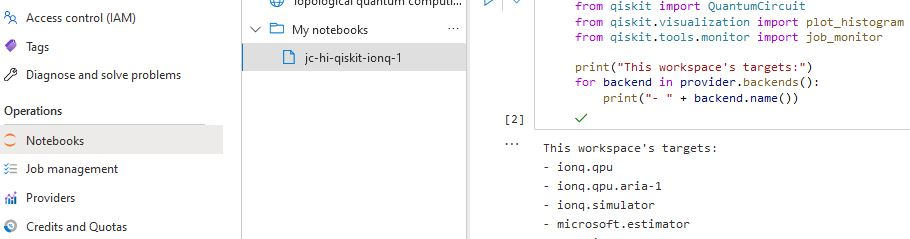

_brief_: https://github.com/infchg/j2?  _former_: https://infchg.github.io/QI?
  
#  🌌 Interest: Thinking about fundamental questions

Quantum Information for practical usages, as well as theoretical tools for exploring Nature 

# Profile: Past, Planned
- Past steps: Theoretical [Physics-Based-Information-Models](#-Physics-Based-Information-Models) published with QKD examples. 
- Recent research on [QI-Tools-Applications](#-QI-Tools--Applications) with Hilbert space and Bloch sphere 
- Next proposal: inter-disciplinary collaboration [planned 2022-23](#planned-2022-23) nearby NYC, part-time:
   - bring two decades achieving complex IT with Teams, Hardware, Instruments, Linux, Routes, DevOps, Python, Cloud 
   - & works with QI theory, matrix operators, eigenstates... plus experiment notions from papers and QisKit 

# Planned 2022-23

*Part-time* due to current commitment delivering a technology project full-time:

- 2022 submitting new journal paper on Bloch & QI framework + another measured from real QC circuits 
- 2023 Q1Q2 collaborations nearby NY towards cloud quantum computing

#  🌱 Physics-Based Information Models 

Proposed Physics-Based Models (alike Toffoli, Benioff, Kirchhoff) and Feynman-charts of Information Change.

 -   "Simulation model applied to IP protocols and satellite communications", Int'l Conf. Advances in Satellite and Space Communications, 2010, pp.122–127, Martínez, J.C., De Haro, L., González, A. https://IEEExplore.IEEE.org/document/5502488 DOI.org/10.1109/spacomm.2010.34 ISBN:9781424472758 on QKD
 -   "Particle-based methodology for representing mobile ad-hoc networks", Int'l Conf. Integrated internet ad hoc and sensor networks ACM, 2006, https://DOI.org/10.1145/1142680.1142685 ISBN:1595934278 oa.upm.es/1666

#  🌱 QI Tools & Applications 

Exploring common frameworks to represent light modes coding qubits across diverse experiments

  -  on Bloch-R3 tools across diverse physical modes, orbital, temporal, parity, spin, … much improved from public preprint  researchgate.net/publication/356697550_Comparative_Analysis_of_Spin_Paths_Temporal_and_Spatial_Modes
  -  on Verifying quantum information designs with Conservation Laws and Change diagrams, BeyondC 2019 Vienna, pp.22 #34, https://beyondc.at/fileadmin/user_upload/p_beyondc/Conference_2019/Book_of_Abstracts.pdf 
    
#  ♥ Thanks to past teams and collaborators.

With gratitude to teams who accepted posters contributions during PhD studies and helped evolve these ideas from early stages:

 -   "Mathematical model for specification and inter-operation between experiments and tools", Neutrinos & Dark Matter in Nuclear Physics, 2006, pp.909-914 http://iaea.org/inis/collection/NCLCollectionStore/_Public/39/005/39005128.pdf pp4
 -  "Quantum Modeling using Information-Particles", TQC2007 Theory of Quantum Computation, Communication, & Cryptography, Jan 24-25 2007 Nara Japan ,  brl.ntt.co.jp/tqc/2007/en/program.htm [] "Physics Oriented objects for modeling QIP", QIP 2007, Australia, Jan 2007,  qinfo.org/qip/program.htm
 
 And MSEE/CS Background: Master of Electrical Engineering (MScEE equivalence certified in California) + a progressive career in hardware and software computing with Industry Agile DevOps,
 
 - @ current: planning Open Cloud Tool - Ongoing - Queue monitoring for Quantum Processing queues in a light dashboard
 - @ IAEA Vienna 2020: Architect & Prototype Hardware+IT for ML analysis of Cherenkov UV light images from nuclear plants 
 - @ WOCE Support 95: Integrated Gravimeter instrument (former NASA [satellite](https://icebridge.gsfc.nasa.gov/?page_id=180)) from hardware to internet data pipeline


## 👋 Nearby

Information-Change J-C - https://github.com/infchg/j2? - tel: (917) 815 xxxx - New York, NY 
 
 $$V_{sphere} = \frac{4}{3}\pi r^3$$


```geojson
{
  "type": "Polygon",
  "jccomm": "just removed         //  [-78,43], ",
  "coordinates": [
      [
          [-76,40],
          [-75,42],
          [-70,43],
          [-74,39.5]
      ]
  ]
}
```
 


## 📕 Reference on new methods of investigation, and new collaborations 

Principles & Productivity Ideas

### Notebooks for sharing codes and results

Example of codes & results using  Azure, QisKit, and IonQC  

### Delivering by Agile & Modern https://modernagile.org/

Fostering Models & Methods in collaborations:

Historic agile XP boosted interdisciplinary teams since 2001, from teams analyzing data to developers to hardware engineers accessing states at tiny fractions of a second. ModernAgile has four pillars: 

- People collaborations enhanced (Git & Jupyter Notebooks);
- Repeat and Continuously Improve (automated pipelines); 
- allowing rapid experimentation;
-  Safe by working in pairs, consumer/provider. It avoided hw/coders overwhelmed or analysts/theorist disappointed.


### Simple Generic frameworks helped build and repeat easily, boosting innovation 

   In the 70s, the DoD's Internet Protocol grew communications exponentially. In the 90’s the CERN's Web open radically boosted information exchange. In 201x's Quantum Computers seamless access helped hundreds of thousands researchers. 

### Effective 5 steps Innovation

Applied recurrently this method inspired in Agile Six Sigma:

- Listen & innovate designs, 
- measure, 
- analyze, 
- continuously automate, 
- communicate & control.
 


---

#### META

- this doc: https://github.com/infchg/j2/blob/master/README.md
- previous 2019 version j2Heroku Build: [](https://travis-ci.org/infchg/j2) 
+ manual checks also Passed 2019-08-24 and 2019 Mar 6th  https://travis-ci.org/infchg/j2
- CI/CD passed too: on repo's Actions tab, Under Workflows, pages-build-deployment no errors in the runs.  


