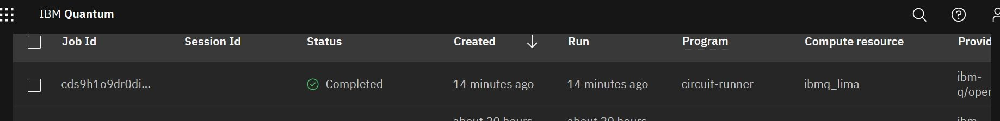

_brief_: https://github.com/infchg/j2?  _former_: https://infchg.github.io/QI?
  
#  🌌 Interest: Thinking about fundamental questions

Quantum Information for practical usages, as well as theoretical tools for exploring Nature 

# Profile: Past, Planned
 

#  🌱 Physics-Based Information Models 

Proposed Physics-Based Models (alike Toffoli, Benioff, Kirchhoff) and Feynman-charts of Information Change.
 
#  🌱 QI Tools & Applications 

Exploring common frameworks to represent light modes coding qubits across diverse experiments
 
#  ♥ Thanks to past teams and collaborators.

With gratitude to teams who accepted posters contributions during PhD studies and helped evolve these ideas from early stages:

 

 
```stl
 
```
 


## 📕 Reference, new methods of investigation, and new collaborations 

Principles & Productivity Ideas

### Leveraging JuPyter Notebooks for sharing QI codes and results  

Example of codes & results using  Azure, QisKit, and IonQC  

Examples launched from a Jupyter Notebook to IBM-QC 


### Delivering by Agile & Modern https://modernagile.org/

Fostering Models & Methods in collaborations:

Historic agile XP boosted interdisciplinary teams since 2001, from teams analyzing data to developers to hardware engineers accessing states at tiny fractions of a second. ModernAgile has four pillars: 

- People collaborations enhanced (Git & Jupyter Notebooks);
- Repeat and Continuously Improve (automated pipelines); 
- allowing rapid experimentation;
-  Safe by working in pairs, consumer/provider. It avoided hw/coders overwhelmed or analysts/theorist disappointed.


### Simple Generic frameworks helped build and repeat easily, boosting innovation 

   In the 70s, the DoD's Internet Protocol grew communications exponentially. In the 90’s the CERN's Web open radically boosted information exchange. In 201x's Quantum Computers seamless access helped hundreds of thousands researchers. 

### Effective 5 steps Innovation

Applied recurrently this method inspired in Agile Six Sigma:

- Listen & innovate designs, 
- measure, 
- analyze, 
- continuously automate, 
- communicate & control.
 


---

#### META

- this doc: https://github.com/infchg/j2/blob/master/README.md
- previous 2019 version j2Heroku Build: [](https://travis-ci.org/infchg/j2) 
+ manual checks also Passed 2019-08-24 and 2019 Mar 6th  https://travis-ci.org/infchg/j2
- CI/CD passed too: on repo's Actions tab, Under Workflows, pages-build-deployment no errors in the runs.  


